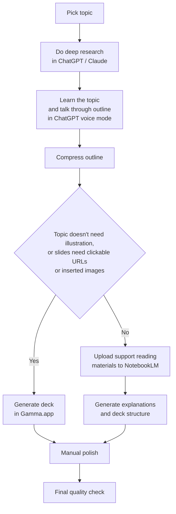

# Slide Creation Workflow with Deep Research + ChatGPT + Claude + Gamma + NotebookLM

## Goal
Create strong study group or class slides quickly by combining:
- **ChatGPT / Claude Deep Research** for topic research
- **ChatGPT voice mode** for thinking through structure
- **Gamma.app** for fast text-based decks
- **NotebookLM** for understanding papers and generating explanation-heavy decks
- **Manual edits** for images, code, repos, diagrams, and final polish

---

## Core Decision Rule

### If the topic is simple and mostly text-based
Use:
- Deep research
- ChatGPT for outline
- **Gamma.app** for fast slide generation

### If the topic is complex and needs strong explanation
Use:
- Deep research
- ChatGPT for outline
- **NotebookLM** for learning, explanation, and source-grounded deck generation
- Manual additions for visuals, code, and practical examples

---

## Workflow



---

## Full Workflow

### 1. Start with deep research on the topic
Use:
- **ChatGPT Deep Research**
- **Claude Deep Research**

Goal:
- understand the topic
- collect the most important ideas
- identify strong supporting sources
- figure out what still needs clarification

---

### 2. Learn and think through it with ChatGPT voice mode
Open ChatGPT voice mode and talk through:
- the topic
- who the audience is
- what each section should roughly cover
- what is confusing
- what facts still need more research

Ask ChatGPT to turn that into:
- a **slide-by-slide outline**
- a rough teaching flow
- a suggested session structure

---

### 3. Compress the outline
If the outline is too long, ask ChatGPT to shorten it to 10,000 characters, that is the limit for NotebookLM

Goal:
- get to **one clean text version** of the whole deck before generating slides
- reduce repetition
- keep only the strongest teaching flow

---

### 4. Choose the slide generation path

#### Path A — Fast path for simpler topics
Use this when:
- the topic is easy to explain
- the slides are mostly text-based
- visuals are not the main challenge

Workflow:
- take the compressed outline
- take the research notes
- put them into **Gamma.app**
- generate the first full deck quickly

#### Path B — Structured path for harder topics
Use this when:
- the concept is hard to explain
- diagrams or infographics are needed
- source grounding matters more
- the session is paper-heavy or technically dense

Workflow:
- identify the **top subtopics**
- identify the **top sources / papers**
- upload the papers or source material into **NotebookLM**
- use NotebookLM to understand and explain the material
- use NotebookLM plus your compressed outline to help generate the main deck structure

---

### 5. Generate the main deck in Gamma.app or NotebookLM
Use AI to generate most of the deck structure and teaching flow using:
- the topic
- the source material
- the compressed outline
- the system prompt below

Goal:
- let AI produce the **main 80%**
- keep your effort for the highest-value 20%

---

### 6. Manually add the final 20%
Note that if this is in NotebookLM, you cannot manually add image or clickable urls, you can only do so in Gamma.app.

Add these yourself:
- custom images
- diagrams AI misses
- GitHub repos
- code examples
- strong real-world examples
- discussion prompts
- visual explanations for abstract ideas

A good rule:
- **AI creates the main deck**
- **you add the most important visual and practical pieces**

Engineers usually want at least:
- one codebase
- one implementation reference
- one concrete practical takeaway


---


## Practical Notes

### What each tool is best at

#### Deep Research
Best for:
- finding the landscape
- gathering sources
- comparing viewpoints
- identifying what matters

#### ChatGPT
Best for:
- turning rough thoughts into structure
- compressing and refining outlines
- adjusting depth for different audiences
- revising language quickly

#### Gamma.app
Best for:
- fast generation of simple decks
- text-based slide creation without very hard concept illustration
- deck with custom image and charts

#### NotebookLM
Best for:
- understanding papers
- generating explanations from source material
- validating flow against real documents
- building decks for technical and research-heavy sessions

#### Manual editing
Best for:
- diagrams
- code
- repos
- standout visuals
- final teaching polish

---

## Best-Fit Use Cases

### This workflow is especially strong for:
- paper reading groups
- technical study groups
- AI architecture talks
- ML concept explainers
- sessions that mix beginners, builders, and researchers

---

## Summary Logic

### Simple topic
**Deep Research → ChatGPT outline → Gamma.app → manual polish**

### Complex topic
**Deep Research → ChatGPT voice mode + outline → compress outline → NotebookLM with sources → AI-generated main deck → manual final 20%**

---

## System Prompt

IMPORTANT NOTE: Paste your topic within the [Insert your topic here] section in the prompt before using it.

```text
Role: You are a top-tier Technical Strategist and Researcher.


Topic:
[Insert your topic here]

Context
We are a study group of entrepreneurial engineers, ML founders, and PhD researchers. Our goal is to move beyond hype, understand the core technical walls of AGI, and identify real product opportunities.


Deck Structure (30–10–20 Format)


Part A — Strategic Overview (Slides 1–6, or 1 to 12)

Vision — the paradigm shift

Cognitive Architecture — the core loop

Industrial Schools — competing worldviews

Technical Taxonomy — how the system organizes space/time

Math / Objective — the optimization framework ( Can go as little as one slide, as much as six slide )

Debate Slide — prompt a 20-minute discussion on which school will win


Part B — Break (Next slide)
7. 10-Minute Break — include a research task students can do with their own tools


Part C — Deep Dive & Applied Future (Next 6 slides pick the relevant ones below to talk about)
8. Current Research — state of the art
9. Gaps — what is still broken
10. Future Trends — next 12–24 months
11. Technical Deep Dive — one major bottleneck
12. Product Ideas — 3–5 practical, high-value project ideas
13. Summary — roadmap from this topic toward AGI


For Every Slide, include 3 boxes:

Beginner Box — one simple analogy-based paragraph, to help software engineer understand this

Builder Box — implementation, tooling, and industry backbones, to help ML engineer understand this

Researcher Box — math, formalisms, and historical roots, to help ML researcher understand this


Formatting Rules

Start every bullet with Bolded Two Words

Follow with a 2–5 word summary

Keep each point to 1–2 lines

Write for a mixed audience: builders, newcomers, and researchers
